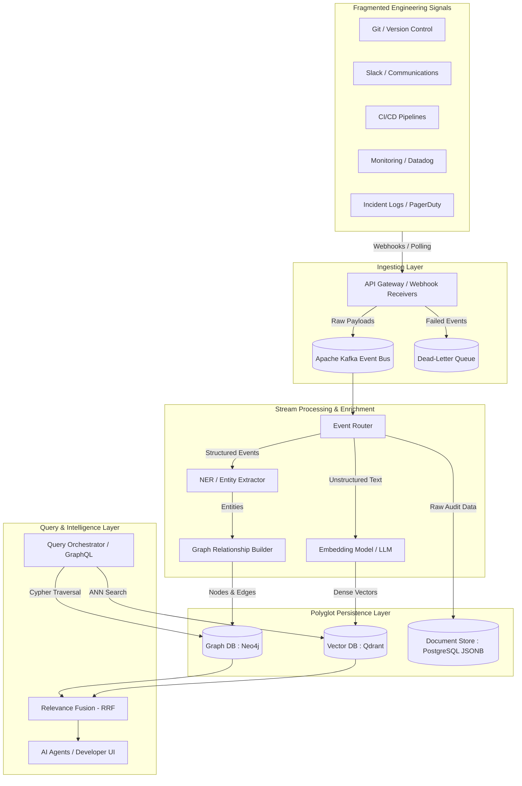
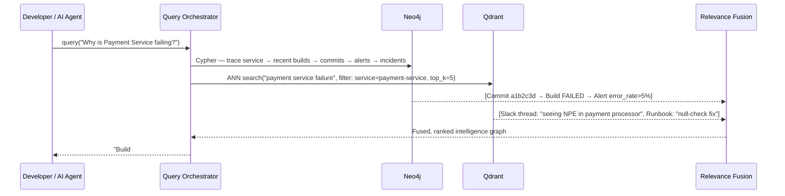

# Unified Engineering Context & Memory Layer

## Overview
Engineering teams generate critical signals across highly fragmented, disconnected systems. Source code lives in version control, infrastructure state in Kubernetes, deployments in CI/CD platforms, and tribal knowledge in Slack threads or incident logs.

This repository outlines a High-Level Design (HLD) for an **Engineering Context Graph**—a decoupled, event-driven system that ingests high-velocity signals from these disparate tools and builds a unified contextual memory layer.

---

## Table of Contents
1. [Architecture Diagram](#architecture-diagram)
2. [System Components](#system-components)
   - [1. Data Ingestion Pipeline](#1-data-ingestion-pipeline)
   - [2. Processing & Enrichment](#2-processing--enrichment)
   - [3. Storage Model (Polyglot Persistence)](#3-storage-model-polyglot-persistence)
   - [4. Indexing Strategy](#4-indexing-strategy)
   - [5. Query System](#5-query-system)
3. [End-to-End Query Walkthrough](#end-to-end-query-walkthrough)
4. [Non-Functional Requirements](#non-functional-requirements)
5. [Scalability & Operational Considerations](#scalability--operational-considerations)

---

## Architecture Diagram



---

## System Components

### 1. Data Ingestion Pipeline

The ingestion layer must decouple high-velocity, bursty signals (like an alert storm or heavy CI/CD traffic) from the heavy graph-processing layer.

#### API Gateway
Lightweight microservices receive **push-based Webhooks** (from Git, Slack, PagerDuty) and run **pull-based API pollers** for systems that don't support webhooks. They handle:
- Schema validation & authentication (HMAC signature verification for webhooks)
- Payload normalization into a **canonical event envelope**
- Rate limiting to protect downstream consumers

#### Canonical Event Envelope
Every event, regardless of source, is normalized into the following schema before being published to Kafka:

```json
{
  "event_id":   "uuid-v4",
  "source":     "github | slack | pagerduty | datadog | jenkins",
  "event_type": "commit.pushed | pr.merged | alert.fired | incident.created | build.failed",
  "timestamp":  "2026-03-08T10:25:00Z",
  "trace_id":   "otel-trace-id",
  "actor": {
    "id":    "user-123",
    "email": "dev@company.com"
  },
  "entities": {
    "service":  "payment-service",
    "repo":     "org/payment-service",
    "commit":   "a1b2c3d4"
  },
  "payload": { /* original, unmodified source payload */ }
}
```

#### Message Broker — Apache Kafka
Gateways publish normalized envelopes to partitioned Kafka topics, guaranteeing zero data loss and allowing independent scaling of downstream consumers.

| Kafka Topic       | Source Systems              | Partition Key       | Retention |
|-------------------|-----------------------------|---------------------|-----------|
| `git-events`      | GitHub, GitLab, Bitbucket   | `repo` name         | 14 days   |
| `ci-events`       | Jenkins, GitHub Actions     | `service` name      | 14 days   |
| `alert-events`    | Datadog, PagerDuty          | `service` name      | 30 days   |
| `comms-events`    | Slack                       | `channel` id        | 30 days   |
| `incident-events` | PagerDuty, Opsgenie         | `incident` id       | 90 days   |

#### Dead-Letter Queue (DLQ)
Events that fail processing after 3 retries are routed to a dedicated DLQ topic (`dlq-events`). An async reconciliation job re-processes these with exponential backoff, ensuring no signal is permanently lost.

---

### 2. Processing & Enrichment

Kafka consumers pick up normalized envelopes and route them based on `event_type`:

#### Structured Event Processing
Commits, deployment statuses, and alert triggers are parsed by a **Named Entity Recognition (NER) / Rule-based extractor** to surface core graph entities:

**Example: A `commit.pushed` event resolves into:**
```
Entities Extracted:
  - (User {id: "user-123", email: "dev@company.com"})
  - (Commit {hash: "a1b2c3d4", message: "fix: null-check in payment processor"})
  - (Service {name: "payment-service"})
  - (PullRequest {id: "PR-456"})

Relationships Created:
  (User)-[:AUTHORED]->(Commit)
  (Commit)-[:BELONGS_TO]->(Service)
  (Commit)-[:PART_OF]->(PullRequest)
```

#### Unstructured Text Processing
Slack discussions, PR descriptions, and incident post-mortems are chunked and embedded:
- **Chunking strategy:** Sliding window with 512-token chunks and 50-token overlap to preserve context across chunk boundaries.
- **Model:** `text-embedding-3-small` (OpenAI) or a self-hosted `all-MiniLM-L6-v2` for privacy-sensitive deployments.
- Each chunk is stored in the Vector DB alongside metadata (`source`, `event_id`, `service`, `timestamp`) for filtered retrieval.

---

### 3. Storage Model (Polyglot Persistence)

A single database cannot handle semantic search, relationship mapping, and raw log storage efficiently.

#### Graph Database — Neo4j

Acts as the **core semantic layer**, storing the deterministic relationship graph.

| Node Label    | Key Properties                                  | Example                                    |
|---------------|-------------------------------------------------|--------------------------------------------|
| `User`        | `id`, `email`, `name`                           | `{id: "u1", email: "alice@co.com"}`        |
| `Commit`      | `hash`, `message`, `timestamp`                  | `{hash: "a1b2c3d", message: "fix: ..."}`   |
| `Service`     | `name`, `team`, `language`                      | `{name: "payment-service", team: "fintech"}`|
| `PullRequest` | `id`, `title`, `status`, `merged_at`            | `{id: "PR-456", status: "merged"}`         |
| `Incident`    | `id`, `severity`, `title`, `resolved_at`        | `{id: "INC-789", severity: "P1"}`          |
| `Alert`       | `id`, `metric`, `threshold`, `fired_at`         | `{id: "ALT-321", metric: "error_rate"}`    |
| `Build`       | `id`, `status`, `duration_ms`, `triggered_at`   | `{id: "BLD-99", status: "failed"}`         |

**Key Relationships:**
```
(User)-[:AUTHORED]->(Commit)
(Commit)-[:TRIGGERED]->(Build)
(Build)-[:DEPLOYED_TO]->(Service)
(Commit)-[:PART_OF]->(PullRequest)
(Alert)-[:FIRED_ON]->(Service)
(Alert)-[:ESCALATED_TO]->(Incident)
(User)-[:RESOLVED]->(Incident)
(Incident)-[:LINKED_TO]->(PullRequest)
```

#### Vector Database — Qdrant

Stores dense vector embeddings of unstructured text for semantic similarity search.

| Field            | Value                                  |
|------------------|----------------------------------------|
| Collection       | `engineering_signals`                  |
| Vector Size      | `1536` (OpenAI) / `384` (MiniLM)      |
| Distance Metric  | `Cosine`                               |
| Index Type       | `HNSW`                                 |
| Payload Fields   | `source`, `event_id`, `service`, `timestamp`, `event_type` |

#### Document Store — PostgreSQL (JSONB)

Acts as the **immutable audit log** of original event payloads.

```sql
CREATE TABLE raw_events (
    id          UUID PRIMARY KEY DEFAULT gen_random_uuid(),
    event_id    TEXT UNIQUE NOT NULL,
    source      TEXT NOT NULL,
    event_type  TEXT NOT NULL,
    service     TEXT,
    received_at TIMESTAMPTZ NOT NULL DEFAULT NOW(),
    payload     JSONB NOT NULL
);

-- Partial index for fast lookups by service + type
CREATE INDEX idx_raw_events_service_type
    ON raw_events (service, event_type)
    WHERE received_at > NOW() - INTERVAL '30 days';
```

**Data Retention Policy:**

| Store       | Hot Retention | Archive Strategy              |
|-------------|---------------|-------------------------------|
| Neo4j       | All time      | Archive resolved incidents after 1 year |
| Qdrant      | 90 days       | Drop old vectors; keep graph edges |
| PostgreSQL  | 90 days hot   | Partition + S3 cold archive   |

---

### 4. Indexing Strategy

#### Graph Indexing (Neo4j)
Strict property indexes on frequently traversed node IDs ensure O(1) lookups:

```cypher
-- Unique constraint indexes
CREATE CONSTRAINT commit_hash_unique FOR (c:Commit) ON (c.hash);
CREATE CONSTRAINT service_name_unique FOR (s:Service) ON (s.name);
CREATE CONSTRAINT incident_id_unique FOR (i:Incident) ON (i.id);

-- Range indexes for time-based traversals
CREATE INDEX commit_timestamp FOR (c:Commit) ON (c.timestamp);
CREATE INDEX alert_fired_at FOR (a:Alert) ON (a.fired_at);

-- Full-text index for PR/commit message search
CREATE FULLTEXT INDEX commit_message_idx FOR (c:Commit) ON EACH [c.message];
```

#### Vector Indexing (HNSW)
HNSW (Hierarchical Navigable Small World) enables ultra-low latency approximate nearest-neighbor (ANN) search across millions of signal embeddings.

| HNSW Parameter  | Value | Description                                       |
|-----------------|-------|---------------------------------------------------|
| `m`             | `16`  | Number of bidirectional links per node            |
| `ef_construction` | `200` | Index-time search width; higher = better recall |
| `ef` (query)    | `128` | Query-time search width; tuned for p99 < 50ms   |
| `on_disk`       | `true` | Memory-mapped for large collections              |

#### Hybrid Search & Relevance Fusion
For rich queries, graph traversal results and vector ANN results are combined using **Reciprocal Rank Fusion (RRF)**:

```
RRF_score(d) = Σ 1 / (k + rank_i(d))
```
where `k=60` and `rank_i` is the rank of document `d` in each retrieval result set. This produces a unified ranked list without needing score normalization across different systems.

---

### 5. Query System

The **Query Orchestrator** exposes a unified GraphQL API. It executes a **scatter-gather** pattern across all storage layers and fuses the results.

**Example GraphQL query:**
```graphql
query WhyIsServiceFailing($service: String!) {
  serviceContext(name: $service) {
    recentDeployments(last: 5) {
      commit { hash message author { email } }
      deployedAt
    }
    activeAlerts {
      metric threshold firedAt
    }
    relatedIncidents(last: 3) {
      id title severity
    }
    semanticContext(query: "payment service failure null pointer", topK: 5) {
      source snippet similarity
    }
  }
}
```

**Cypher traversal (Graph DB):**
```cypher
MATCH (s:Service {name: $service})<-[:DEPLOYED_TO]-(b:Build)<-[:TRIGGERED]-(c:Commit)<-[:AUTHORED]-(u:User)
WHERE b.triggered_at > datetime() - duration('PT1H')
OPTIONAL MATCH (a:Alert)-[:FIRED_ON]->(s)
OPTIONAL MATCH (a)-[:ESCALATED_TO]->(i:Incident)
RETURN c.hash, c.message, u.email, b.status, a.metric, i.severity
ORDER BY b.triggered_at DESC LIMIT 10
```

---

## End-to-End Query Walkthrough

**Question:** *"Why is the Payment Service failing right now?"*



**Step-by-step trace:**
1. **Orchestrator** receives the natural language query and resolves `payment-service` as the target entity.
2. **Graph traversal** (Neo4j): Finds that `payment-service` received `Build #99` 5 minutes ago, containing `Commit a1b2c3d` (message: "fix: null-check in payment processor") by Alice. An `Alert` for `error_rate > 5%` fired 4 minutes ago and escalated to `INC-789`.
3. **Semantic search** (Qdrant): Retrieves the top-5 most similar historical Slack threads and incident post-mortems, including a thread from 3 months ago describing the same NPE with a known fix.
4. **Relevance Fusion (RRF)**: Merges graph facts with semantic context into a single ranked response.
5. **Response**: The developer gets deterministic root-cause data (who deployed what, when) *combined with* historical tribal knowledge (how similar issues were resolved before).

---

## Non-Functional Requirements

| Requirement        | Target                                      | Strategy                                             |
|--------------------|---------------------------------------------|------------------------------------------------------|
| **Ingestion Throughput** | ≥ 10,000 events/sec sustained          | Kafka horizontal partition scaling; stateless gateways |
| **Graph Query Latency** | p99 < 100ms for 2-hop traversals        | Neo4j composite indexes + read replicas              |
| **Vector Search Latency** | p99 < 50ms for top-10 ANN search     | HNSW with tuned `ef=128` + Qdrant on NVMe SSDs       |
| **End-to-End Query** | p99 < 500ms total (scatter-gather)         | Parallel fan-out; async RRF fusion                   |
| **Availability**   | 99.9% uptime for query layer                | Multi-AZ deployment; orchestrator is stateless        |
| **Data Durability** | Zero event loss at ingestion               | Kafka replication factor 3; DLQ for failed processing |
| **Consistency**    | Eventual for graph writes; strong for raw docs | Kafka at-least-once delivery; idempotent graph upserts |
| **Observability**  | Full trace visibility across all layers     | OpenTelemetry on all services; `trace_id` propagated in envelope |

---

## Scalability & Operational Considerations

### Horizontal Scaling
- **Kafka Consumers**: Each processing stage (NER, embedding, graph writer) is a stateless consumer group. Scale out by adding instances; Kafka rebalances partitions automatically.
- **Neo4j**: Run 1 primary + N read replicas behind a load balancer. Route all query traffic to read replicas; write traffic to primary only.
- **Qdrant**: Use the distributed mode with collection sharding (e.g., 4 shards × 2 replicas) to handle billions of vectors horizontally.
- **Query Orchestrator**: Stateless; scale horizontally behind a load balancer.

### Observability
- **Distributed Tracing**: The `trace_id` field in the canonical event envelope is propagated via OpenTelemetry through every layer (gateway → Kafka → processor → DB writes → query). This enables end-to-end latency attribution.
- **Metrics**: Each Kafka consumer group exposes `consumer-lag` metrics. Alert on lag > 10k events for any topic.
- **Logging**: Structured JSON logs with `event_id`, `trace_id`, `service`, and processing duration at each stage.

### Idempotency
All graph writes use upsert semantics (`MERGE` in Cypher) keyed on the unique entity ID (e.g., `commit.hash`, `incident.id`). This ensures Kafka's at-least-once delivery does not create duplicate nodes.

```cypher
MERGE (c:Commit {hash: $hash})
ON CREATE SET c.message = $message, c.timestamp = $timestamp
ON MATCH SET  c.message = $message
```

### Future Enhancements
- **Real-time anomaly detection**: Add a Flink job on the `alert-events` topic to detect alert storm patterns and pre-aggregate context before it's queried.
- **Feedback loop**: When developers mark a query response as helpful/unhelpful, use that signal to fine-tune re-ranking weights in the RRF fusion layer.
- **Multi-tenant isolation**: Namespace all graph nodes and vector payloads by `org_id` to support SaaS multi-tenancy.

